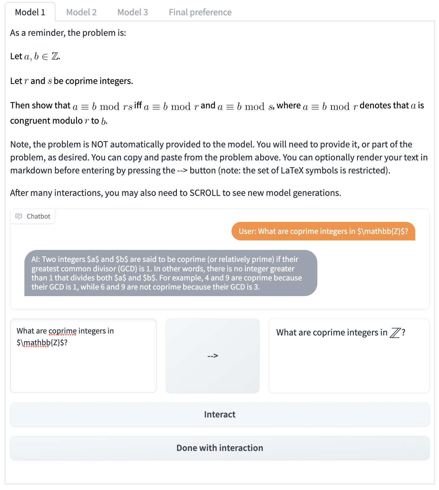

# CheckMate: A Prototype Adaptable Platform for Interactive Comparative Evaluation of LLMs 

We include code for our protoype interactive LLM evaluation platform, CheckMate, as introduced in our [working paper](https://arxiv.org/abs/2306.01694). 

Note: this codebase is a *work-in-progress*. The code will be cleaned and further commented shortly. Along with notes on how to start a server. 



We include an overview of how to adapt the platform for your own tasks in the User Guide of our [working paper](https://arxiv.org/abs/2306.01694).

The data we have already collected, as part of MathConverse, is posted in ``data/mathconverse_parsed_interactions.csv``. Columns are as follows: 
* model: name of the model the user was interacting with. note, participants did not know model identity when interacting.
* human_interactions: queries provided by the human during the interaction trace. each entry in the list was an interaction in the same interaction trace.
* model_responses: the model's response associated with each query. 
* correctness_ratings: participants' ratings of mathematical correctness for each model response.
* helpfulness_ratings: participants' ratings of perceived helpfulness for each model response.
* solo_solve: the participants' self-declared confidence in their ability to solve the problem on their own in advance. MISSING if the participant did not provide.
* problem_name: name of the problem interacting with (see data/ for all problems). 
* selected_topic: topic the participant selected to interact with. 
* uid: a unique, randomly generated id to associate with that participant's round of interactions.
* time_taken: time (in sec) spent by the user in total on the model interactions and ratings.
* mth_bkgrd: self-declared level of mathematical experience.
* ai_play_bkgrd: self-declared amount of experience interacting with AI systems prior to participating in the survey.
* interaction_set_idx: order of the set of three interactions that the participant was undertaking (zero-indexed; e.g., if this is 1, then this is the second round of three model ratings the participant is providing). 
* final_prefs: user-provided preferences over the models. MISSING if incomplete or not provided.

NEW!!! We have also uploaded an annotated taxonomy of user queries at ``data/annotated_taxonomy.csv``

We will provide a further processing script shortly. ``questions_to_ask.txt`` are a set of pre-registered questions that we wanted to ask of the data. Questions were written prior to any data collection; these were last updated on April 6, 2023.

## Launching the server
At present, the CheckMate code is seeded with the interface to run our mathematics evaluation. To start the code, you should provide your own API key in ``model_generate.py``. You can launch the survey by running: ``gradio experiment.py`` assuming that you have installed [gradio](https://gradio.app/). We used gradio version 3.19.0 but later versions should also work.

## Contact
If you have any questions, please do not hesitate to add as an Issue to our repo, or reach out to kmc61@cam.ac.uk and/or qj213@cam.ac.uk.

## Citation
If you use our code and/or data, please consider citing us at: 
```
@misc{collinsJiang2023interactiveMathEval,
      title={Evaluating Language Models for Mathematics through Interactions}, 
      author={Katherine M. Collins and Albert Q. Jiang and Simon Frieder and Lionel Wong and Miri Zilka and Umang Bhatt and Thomas Lukasiewicz and Yuhuai Wu and Joshua B. Tenenbaum and William Hart and Timothy Gowers and Wenda Li and Adrian Weller and Mateja Jamnik},
      year={2023},
      eprint={2306.01694},
      archivePrefix={arXiv},
      primaryClass={cs.LG}
}
```

``

``
